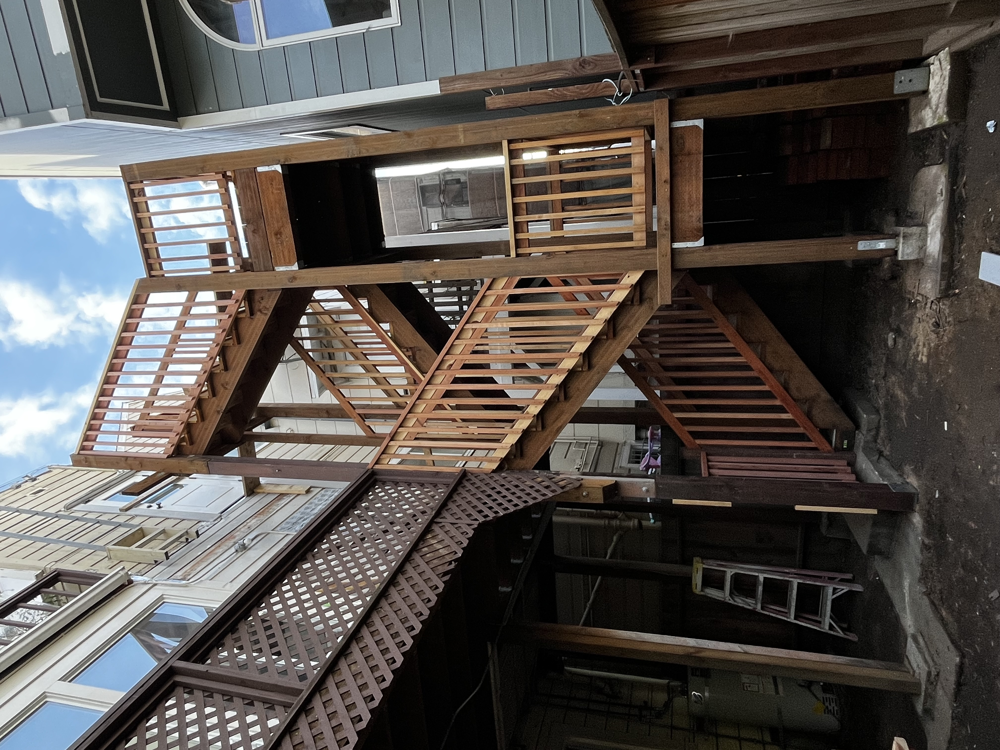
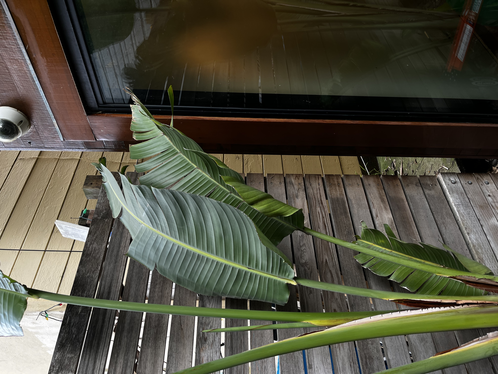
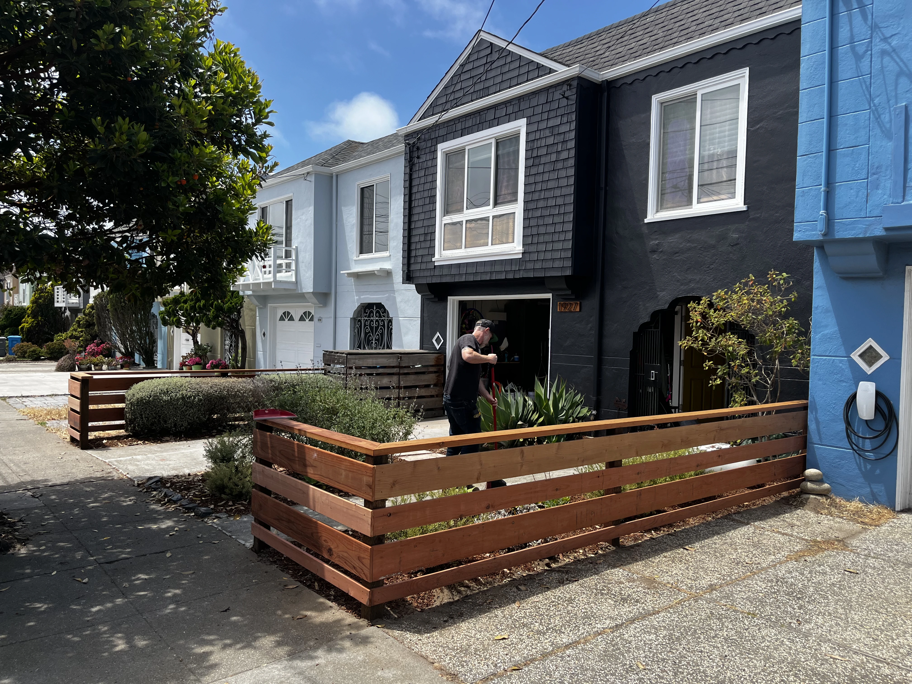
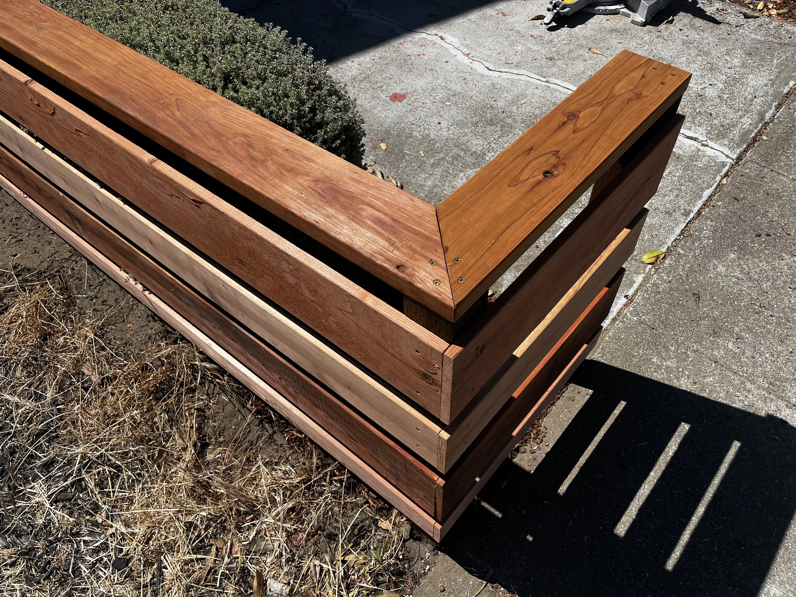
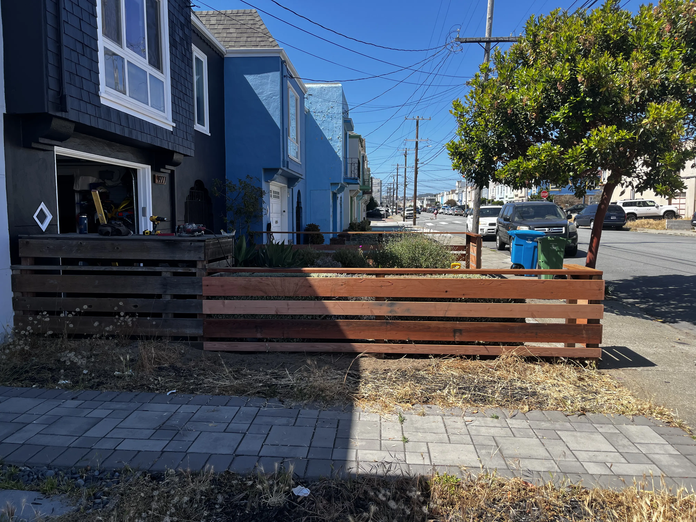
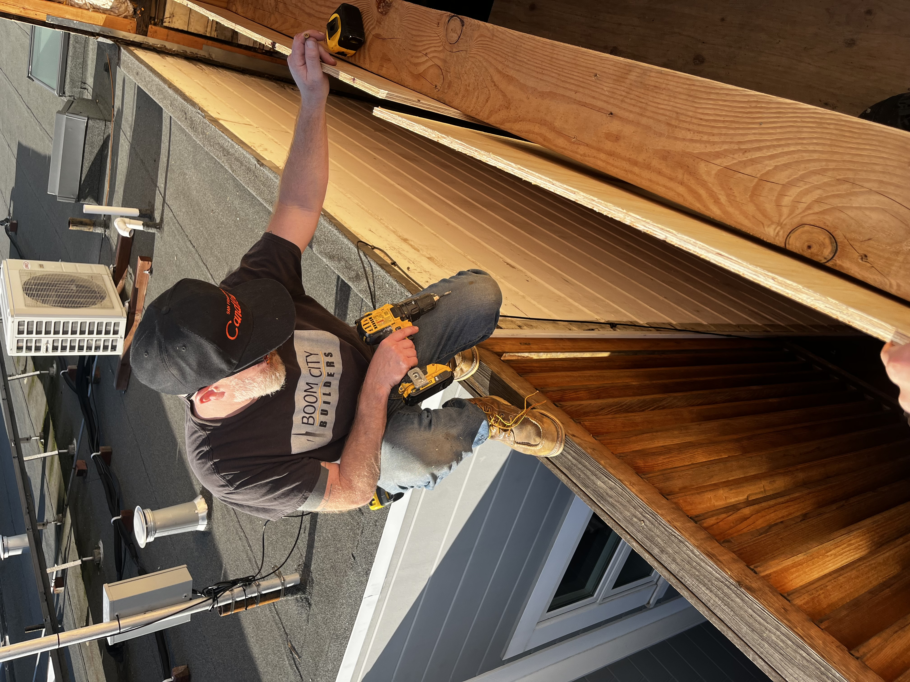

# Boom City - A Year In Review 
---
Halloween 2024 I respond to a Craigslist ad for a construction laborer opening. Roughly a week later, I'm 
the newest employee at Boom City Builders - a local residential contractor owned and opertated by Bay native Garritt Blanz.

For the last year and a half, I've worked as Garritt's right-hand man on a number of projects around the City. Most of my time 
has been spent at Garritt's home in Bernal Heights where we're in the process of an ambitious remodel. 

This post is intended to catalog images and stories from 2025's many work days.

# Guerrero
---
A few minute walk from my spot on Valencia, Guerrero was the first job I was given significant ownership of. My initial visit was 
in December of 2024, at which point the project was well underway - rebuilding a three-story exterior staircase, commonly found
on homes all over the City. Homeowners Chris and Kim are close friends of Garritt and his wife Ryan and were lovley clients to 
work for. 

When I joined on, much of the structural work had already been done. Eventually Garritt and I would replace the uppermost sections 
of two of the original 6x6 posts, as they were weathered and beginning to rot, but most of my time was spent framing out the stairs, 
landings, and handrails. 

 

# York 
---
Throughout the year I spent more than a few days at York. Mold investigations, fence and deck upgrades, 
a full roof replacement. I've had the privelege of working on a number of beautiful San Franciscan homes, 
1306 York St stands apart from the rest. 

 

# Fence  
---
Cedar is a recurring theme at York. This fence repair/upgrade was a solo project. Garritt sourced 
the stack of high quality one-bys; I laid out, cut, and installed boards to extend the left side of the 
fence and fill the awkward corner gap where the perimeter meets the house. 

I love repetitive finish work like this. After the first few cuts, I slip into a flow state - 
each board is perfectly sized, every screw layout uniform and square. Days like this are a treat. 

## Before 
---

## After 
---

# 44th 
---

# Precita 
---

